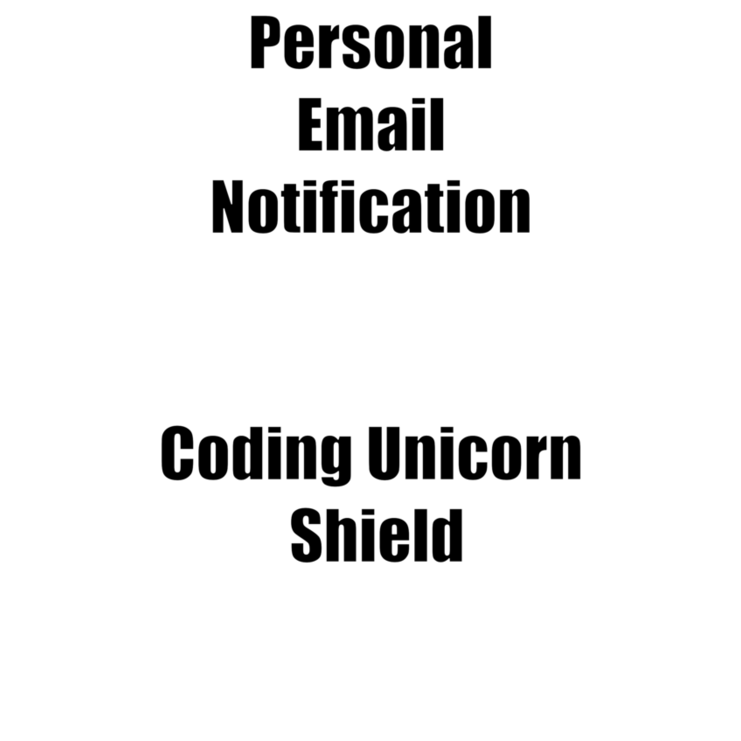
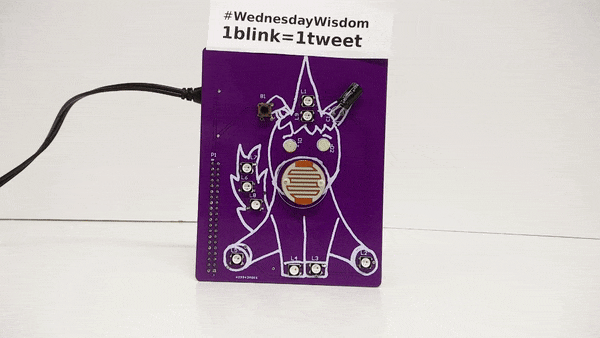

# Coding Unicorn Shield Projects

Find more Information on Kickstarter (coming soon)!

In this repository we will keep a list of examples and tutorials how to use the Coding Unicorn Shield. We will also link to other projects. If you have any questions or feedback feel free to make commit or send us an email to  samuel@codingworld.io . You can find more German resources on [codingworld.io](https://codingworld.io)

> Please note that all of the documentation and code is still in beta status. We will improve it in the next weeks and months. If you have any feedback or concrete improvements make a commit or send us a email to samuel@codingworld.io

## Demo and Documentation
With this project we are showing you the current status of the Python Libary for the Raspberry Pi and how you can create your own Demo. You can find the [example code here](demo+documentation/demo.py) and the [documentation and the tutorial here](demo+documentation/).

## Personal Email Notifications
With this project you will your own personal email notification unicorn. Check with one lock if you have unread emails or use the do not disturb mode. You can find the [example code here](email-notifications/email-notifications.py) and the [tutorial here](email-notifications)

## Hashtag Watcher
With this project you can make your Unicorn Shield blink everytime a certain hashtag is used on Twitter. You can find the [example code here](hastag-watcher/hastag-watcher.py) and a [tutorial here](hashtag-watcher).

## The photobooth

This is a small example what you can do with the Unicorn Shield and the Raspberry Pi Camera Module. We have the [example code](/photobooth/photobooth.py) and a short tutorial [here](/photobooth).

## People on the ISS
Do you every whonder how many people are in space? With the Coding Unicorn Shield and the Raspberry Pi you can easily build a display for that.  We have the [example code](/people-in-space/people-in-space.py) and a short tutorial [here](/people-in-space).

