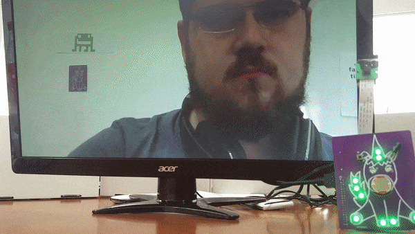
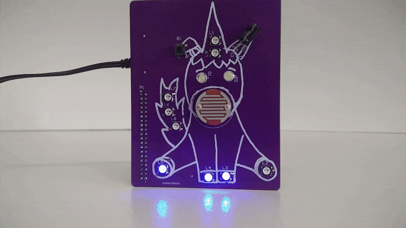

# Coding Unicorn Shield Projects

Find more Information on Kickstarter (coming soon)!

In this repository we will keep a list of examples and tutorials how to use the Coding Unicorn Shield. If you have any questions or feedback feel free to make commit or send us an email to  samuel @ codingworld.io . You can find more German resources on [codingworld.io](https://codingworld.io)

## The photobooth

This is a small example what you can do with the Unicorn Shield and the Raspberry Pi Camera Module. We have the [example code](/photobooth/photobooth.py) and a short tutorial [here](/photobooth).

## Hashtag Watcher
With this project you can make your Unicorn Shield blink everytime a certain hashtag is used on Twitter. You can find the [example code here](hastag-watcher/hastag-watcher.py) and a [tutorial here](hashtag-watcher).

## People on the ISS
Do you every whonder how many people are in space? With the Coding Unicorn Shield and the Raspberry Pi you can easily build a display for that.  We have the [example code](/people-in-space/people-in-space.py) and a short tutorial [here](/people-in-space).

