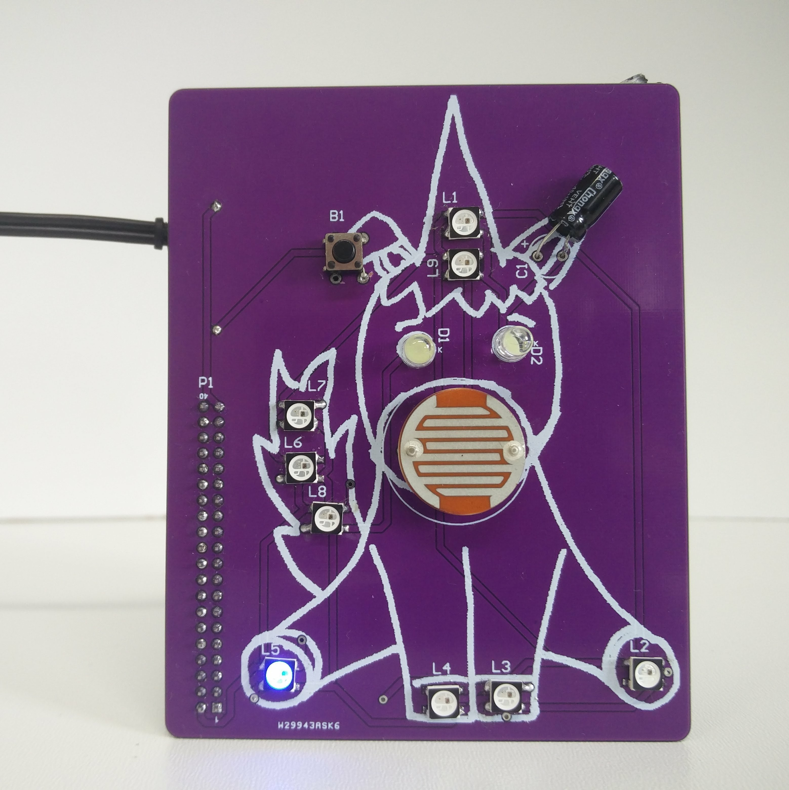
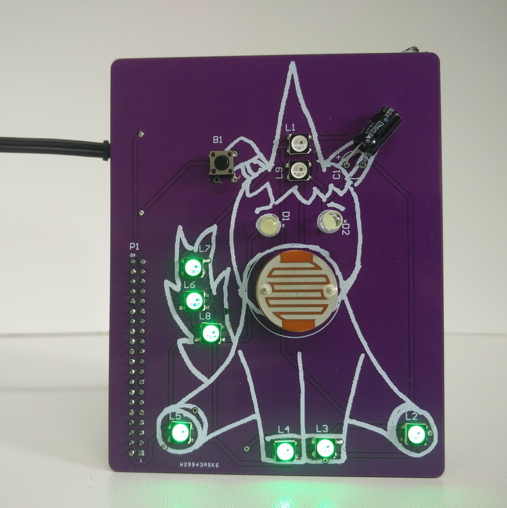
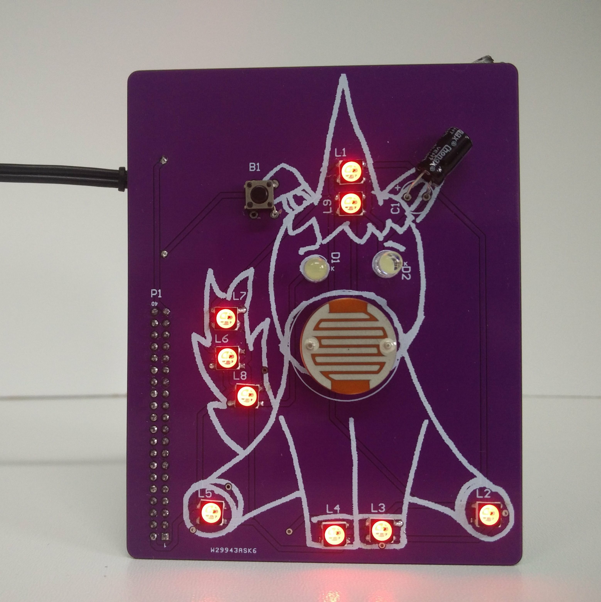
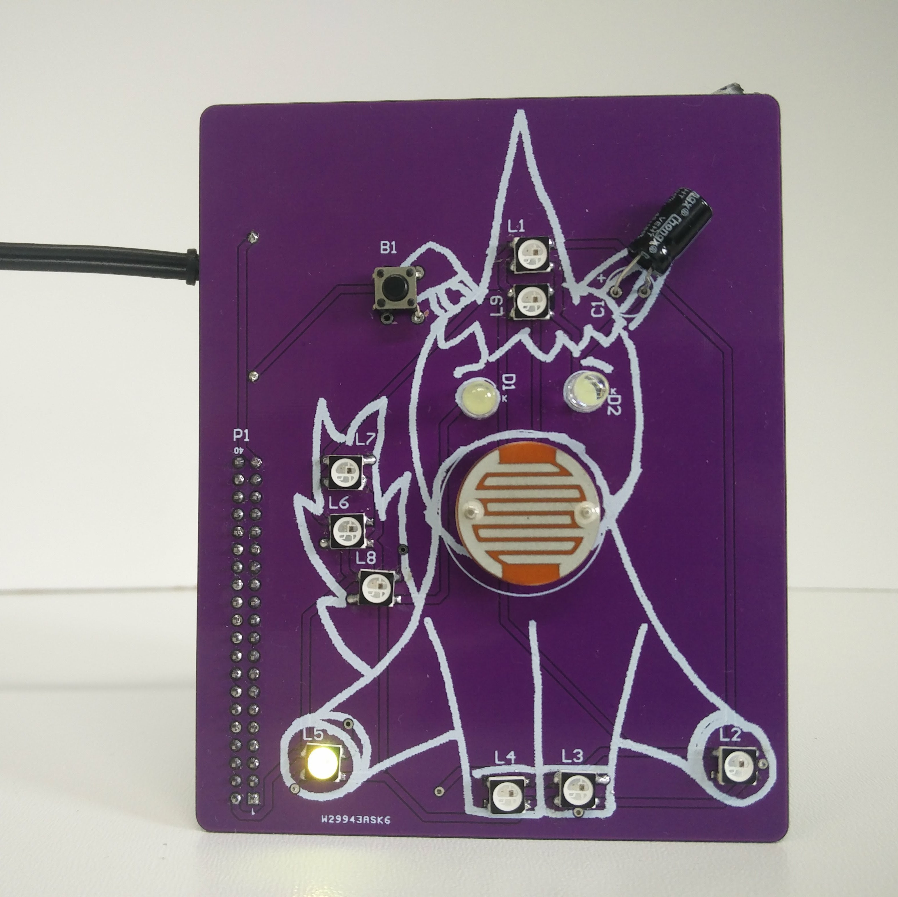

## Coding Unicorn Shield Project: Personal Email Notifications

Emails are one of the dinosaurs of commnication methods. It's older than the World Wide Web and are still used by many people today. We use it in the Coding World office on a daily basis. So why not visualise with how many unread emails you have and what better to use than a cute unicorn! Here we have some example on how it looks in reality:


## Basics
Even though that email is quiet old it is still used a lot. One reason is that everyone can just install a email server and start sending their own emails. Another reason for this is, that their are open protocolls for managing your emails. One of them is called [IMAP](https://en.wikipedia.org/wiki/Internet_Message_Access_Protocol). This protocolls enables multiple email clients (like your web mail, [thunderbird](https://www.mozilla.org/en-US/thunderbird/) or apps ) to manage your emails at the same time. Because this protocoll is open and so standarized we can easily integrate it into our python or other programming projects.The necassary libaries are already installed on your pi.

## What you need
1. Running Raspberry Pi with an Internet connection
2. An E-Mail account + Credentials (email, password and maybe the server)
3. Your Coding Unicorn Shield


## The Code

[**email-notifications.py**](email-notifications.py)

```python
import imaplib
import unicornshield as unicorn
import time

mailServer = 'server'
mailUsername = 'password'
mailPassword = 'password'

mail = None

def connect():
	global mail

	mail = imaplib.IMAP4_SSL(mailServer)
	mail.login(mailUsername, mailPassword)
	mail.list()
	mail.select("inbox")

connect()

def getUnreadmails():
	data = mail.search(None, 'UNSEEN')
	unreadmails = len(str(data[1]).split())
	if str(data[1]) == "['']":
		unreadmails = 0
	return int(unreadmails)

doNotDisturb = False
lastChecked = time.time()
waitTillNextCheck = 60*2
unreadmails = getUnreadmails()

while True:
	oldUnreadMails = unreadmails
	if time.time() > lastChecked+waitTillNextCheck:
		try:
			unreadmails = getUnreadmails()
		except:
			connect()
			unreadmails = getUnreadmails()
		lastChecked = time.time();

	if unicorn.buttonPressed() == True:
		if doNotDisturb == False:
			doNotDisturb = True
		else:
			doNotDisturb = False
		print(doNotDisturb)
	unicorn.clear()
	if doNotDisturb == True:
		unicorn.setPixel(0,0,0,155)
		unicorn.show()
	else:
		if oldUnreadMails == unreadmails:
			pass
		if unreadmails <= 9 and unreadmails >=1:
			for x in range(unreadmails):
				unicorn.setPixel(x, 0, 155, 0)
		elif unreadmails > 9:
			unicorn.setAll(155, 0, 0)
		else:
			unicorn.setPixel(0,150,150,0)
		unicorn.show()
		time.sleep(0.1)
```

## Step for Step
Because the code is very long we won't got for everything into detail. You find more information in the [Demo and Documentation Project](../demo+documentation).

In the first three lines we are importing all the necassary libaries. We need the `imaplib` for the communication with the email server.

In line 5 to 7 we defining the variables for the email server settings. *mailServer* is for the adress of the mail server (e.g.: imap.googlemail.com), the second is *mailUsername* this is usually your email adress and *emailPassword* for your email password. Please keep in mind that you should never publish this information publicly.

In the next step we are creating an empty variable with the name *mail* we need this in the later use.

In line 11 we are creating our function and are calling it `connect()`. In this function we will handle the connection process to the email server. For this we first need make the variable *mail* accessiable in the function. In the next step we turning all the Pixels/RGB LEDs white in line 14 and 15 so the user knows, what is going on.
In the lines 16 to 19, we are creating the email connection with the credentials we have created before and opening the inbox. This is main folder and the folder you normally see your new emails. In the end of the funciton we are turning the Pixels on the Unicorn Shield off.

In line 22 we are calling this function for the first time. Keep in mind that this function will then change the *mail* variable which we can use later.

In the line 24 we are creating a second function. It is called `getUnreadmails()`. This function is, like the name suggest, to get a number of how many unread emails are in the inbox. For this we are creating in line 25 the variable *data* and are saving in it the results of `mail.search(None, 'UNSEEN')`. With this function we can server our inbox for unseen emails. In the next step we only need to get the amount of unread emails. Unforunatily we need to some tricks in line 26. All we are doing is converting the result and then count it with the `len()` function. Unless their are no emails, we have now the amount of unseen emails saved in the variable *unreadmails*. In line 27 and 28 we are checking for the possibilites that their are no unseen emails in the inbox. In line 29 we are returning the number of emails.

In line 31 to 34 we are defining some variable that will important in the next step. Here we are also calling for the first time the `getUnreadmails()` function.

In line 36 our main program starts with a while loop that is always running. In the beginning of the loop we are saving the amount of emails which are here before checking the amount the of unread emails eagain.

In line 38 we have an if statements that checks if it is time again to check the emails. You don't want todo that too often because a) it's normally not changing so often b) you don't want to give your email servers too many requests. You can vary this waiting time with changing the variable *waitTillNextCheck* in line 33. The wait time is saved in seconds.
If it is time for checking again, the code intended from line 39 to 43 are executed. Here we have a try statement. This statement is checking if the `getUnreadmails()` is able to perform it's job. If we use this problem longer, it can happen that the connection breaks. In this case we are creating the connection again in line 42 and getting the amount of unread emails in line 43.
Either way, we are saving in the variable *lastChecked* the last time we have checked.

In the next part from line 46 to 50 we are checking if their is any change for the do not disturb function. We are checking this by getting  the status of the button with the function `.buttonPressed()`. If the button is pressed the status chould change. Luckily their are only two possibilites. Either the Variable *doNotDisturb* is `True` so disturbins or it is `False`.

The part from line 52 to 67 is the last part. In this part we are creating the visulation for the emails.
For this we are usinng multiple if statements.
In the first if stement beginning in 53 we are checking if the `doNotDisturb` is on. In this case we don't want to show any information. For this we simply color the first Pixel in blue in line 54 and 55. This looks like this on the shield:



In the else statement we are than handeling the email visualisations. In line 57 we have an if statements that checks if the amounf of emails has changed. If this is not the case, the `pass` comand in line 58 will be execxuted and the while loops start from the beginning. If their is no change, than their is simply no need to change the visualisation on the unicorn.

In 59 we are checking in the if statements that the variable *unreadmails* is less or equal than 9 and more equal than 1. If this is the case, the for loop in line 60 and 61 is activated. With the help of this for loop we display so many Pixels in the green color as their are unread emails.Here is an example for 7 unread emails:




Now we only have two possible cases left. In line 62 we are checking if their are more than 9 unread emails. In this case, we can't display the amount of emails correctly but we can just make all pixels glowing in the red color. This is maye also a good motivation to finally check on those unread emails.



The only other case is checked in line 64 and 65. If we don't have any unread emails we also want to display that. For this we are using just the color yellow on the first pixel.



Because we don't want to write `show()` for every possible ways and so only copy and paste, we used it once on the end.


## Conclusion
A) Emails are great and a good examples why open systems can be an awesome playground! You couldn't have done this easiy for facebook messanges or snaps.
B) The Coding Unicorn Shield is a great addon for such Projects! You can use the LEDs for creating awesome animations and the input devices for interactions.
