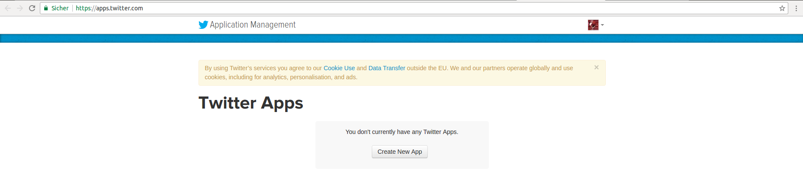
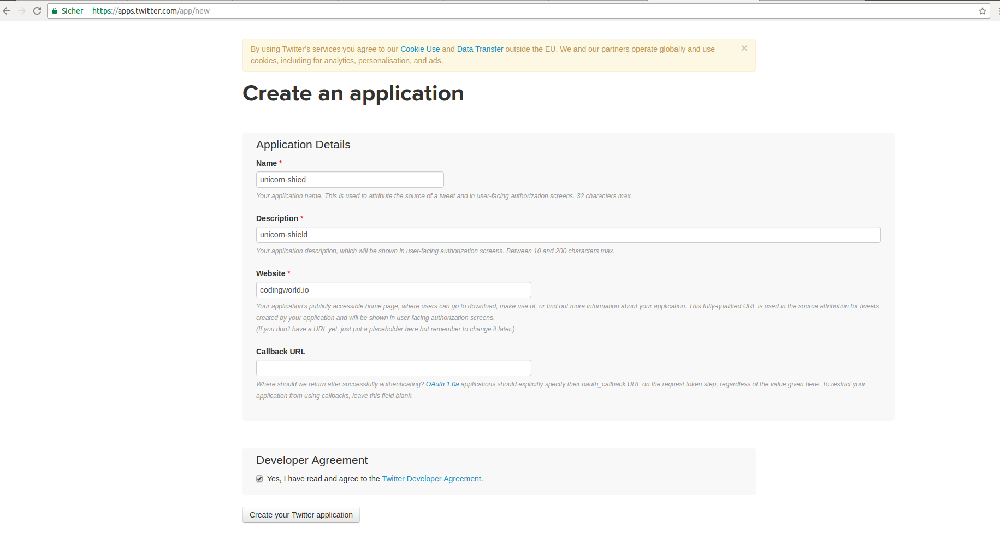

# Create Twitter Account for API access

The first step is to create a Twitter account. You can do that on [twitter.com](https://twitter.com/). For getting API access, you might need to also add verify phone number.

The next step is to create a app. The app will then get the credentials so you can use the Twitter API.

[apps.twitter.com](https://apps.twitter.com/)

On this page you first of all need to create a new app. Just do that with the `Create New App` Button.

Here you need to fill in all the information before you can create your app.

On the next Page you will find all the Twitter credentials which are important for getting API access. Use for that the Tab which is called `Keys and Access Tokens`.

You might to generate your Access Tokens.

> Never display or share this credentials with anyone because they will gain access to your twitter account and also might miuse it.

The following Tokens are important:
1. Consumer Key (API Key)
2. Consumer Secret (API Secret)
3. Access Token
4. Access Token Secret
