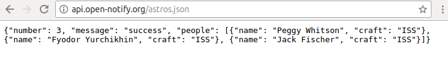

# Coding Unicorn Shield: People in Space Project


## Basics

Have you every looked in the sky and wondered if their are other inteligence forms of life out their? Well we have! This question is just pretty hard to answer because we simply don't know but what we know is how many people are in space at the moment. This people are most in space crafts to the [ISS](https://en.wikipedia.org/wiki/International_Space_Station) or are simply in the ISS. Because we know this number so well, we can display this number on our Coding Unicorn Shield. Every time the nose is touched we are getting new information from an [API](https://en.wikipedia.org/wiki/Application_programming_interface). An API is way for easy communication with different programs. And their is an API that is perfect for our use case. You can find it on the following URL:

[http://api.open-notify.org/astros.json](http://api.open-notify.org/astros.json)



If you open it in your browswer it will look like this and their is the number of people who are currently in space. We will use RGB LEDs on the Coding Unicorn Shield to display the number of people who are in Space.

This tutorial is based on an [Worksheet "People in Space Indicator" from the Raspberry Pi Foundation. You can find their further information](https://www.raspberrypi.org/learning/people-in-space-indicator/worksheet/).

## What you need

For this you need:
1. A running Rasbpberry Pi with a Internet Connection
2. Your Coding Unicorn Shield

## The Code

[**people-in-space.py**](people-in-space.py)

```python
import unicornshield as unicorn
import requests
from time import sleep
from random import randint

url = "http://api.open-notify.org/astros.json"

def displayPoepleInSpace():
  unicorn.clear()
  for i in range(9):
    unicorn.setPixel(i, randint(0,255),randint(0,255),randint(0,255))
    unicorn.show()
    sleep(0.3)
  r = requests.get(url)
  j = r.json()
  n = j['number']
  unicorn.clear()
  for i in range(n):
    unicorn.setPixel(i, 0,0,255)
    unicorn.show()

displayPoepleInSpace()

try:
  while True:
    if unicorn.nose() > 0.2:
      displayPoepleInSpace()
except:
  unicorn.clear()
```
`sudo python people-in-space.py`

You can always end the program with `Ctrl+C`.

## Step for Step
In the first four lines we are inlcuding all the neceassy libraries. This is the `unicornshield` for making the animations on the Coding Unicorn Shield happening. We need the `requests` library for working with the API and the `time` and `sleep` libaries for making cool annimations.

In line 4 we are creating the varaible *url* and saving in it the url for the api.

In line 8 we are creating our own function called *displayPeopleInSpace()*. We are putting all the logic of displaying the number of people in space in this function.

First of all is in line 9 to line 13 the beginning animation, so that the user knows that we are about to fetch new data from the library. For this we are first of turning all RGB LEDs off, we are using for this the `.clear()` function. In line 9 we are having a foor loop, with which we can activate every sinle LED. In line 11 we are setting a color to pixel with the function `.setPixel()`. This function has as first parameter the number of the led (0 to 8) and after this the rgb (red, green, blue) color specturm. But this time we are not defining one single color, but are using the `randint()` function to generate a random number between 0 and 255. This are minimal and maximal values we can use. This system is widely used to create colors. So from line 10 to 13 we are creating a animations, which gives every RGB LED a different color.
In line 14 to 16 we are talking to library and are getting the number of people in space.


In 14 we are creating the request and are saving the whole answer of the request in the variable *r*. This takes a while because we python code needs to get the whole site. In the next line we using the function `.json()` to get the json part from the request. [Json](https://en.wikipedia.org/wiki/JSON) is widly used data format. Because python already knows what json is and how to transform it into a dataype python can use, the type of the variable *j* is a dictionary. This is similar to list. So what did here is to call the url and then get the data on this site and transform into datatype we can use in our program. This is happening in line 16, their we create the vairable n and giving it the value `j['number']`. Now we have saved the number of people in space in the variable *n* and the number is already in the integer format, so we can use it right aways.

This is exacatly we are doing in line 18. After clearing all the LEDs, we now only want turn so many RGB LED's on, as people are in space. For this we are using the for loop in line 18. This basically says, create a list counting from zero to the amount of people in space (or short *n* for the variable). Then in line 19 and 20 this LED's are turned blue.

This is the whole funtion. But we also need to put this function into use in our program.

For this we are calling the function in 22, so that in the beginning of our program their is something visual happening for the user.

After this we have a while loop, wrapped inside a try statment. With this every which is intended in line 26 and 27 is executed as long the program is running. You can always close the program with `Ctrl + C`. In this case, line 29 is called and all the RGB LED's are turned off.

In line 26 (inside the while loop), we are checking if the nose is touched, if this is the case the function `displayPoepleInSpace()` is called, and is checking if their are people in space.

You can also change in line 19 the color for the people in space if you like.


## Conclusion
With this little program you can easily build a cool decoration for every space nerd! But it also shows what things we can display with the Coding Unicorn Shield.

Code - Create - Change
